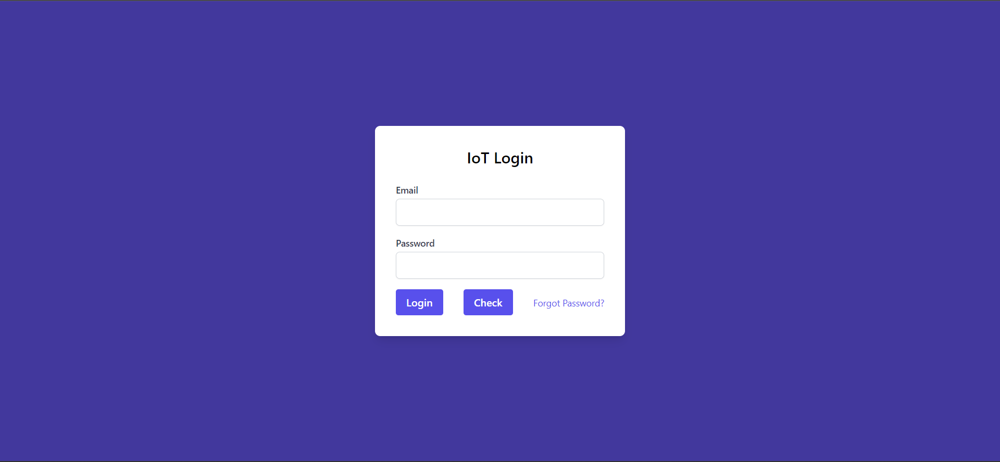
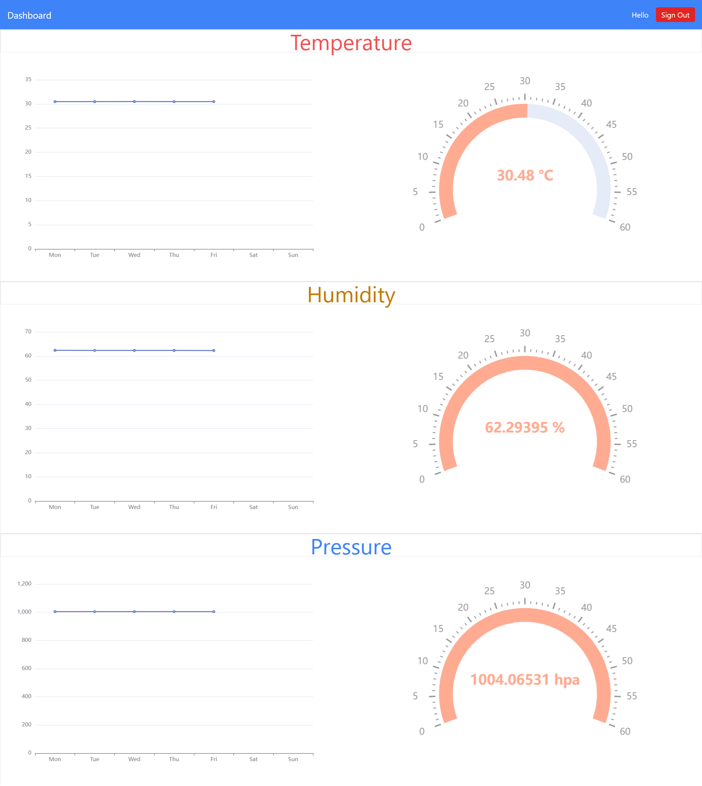

# IoT Portal

This is an Angular web application that retrieves the weather data parameters including Temperature, pressure and humidity from a real-time database using google firebase. 
The web app includes:
1. **Authentication page**: For registered users to sign in into their weather dashboard
2. **Dashboard page**: A dashboard page that shows updated real-time weather data through gauges and grids.
    
## Built with
- AngularJS
- Firebase

## Getting Started
1- Clone the repo on your local device
2- run ``npm install`` to install all needed dependencies
3- run ``ng g environments`` to create environment folder in your angular application
4- Setup a real-time database on Google Firebase by following this [guide](https://www.youtube.com/watch?v=pP7quzFmWBY)
5- Inside the environment.ts file add the following object with your own firebase credentials
``
export const environment = {
  firebase: {
apiKey: 'YOUR_API_KEY',
  authDomain: 'YOUR_AUTH_DOMAIN',
  projectId: 'YOUR_PROJECT_ID',
  storageBucket: 'YOUR_STORAGE_BUCKET',
  messagingSenderId: 'YOUR_MESSAGING_SENDER_ID',
  appId: 'YOUR_APP_ID'
  },
  production: false
};
``
6- Type ``ng serve`` to run your application

