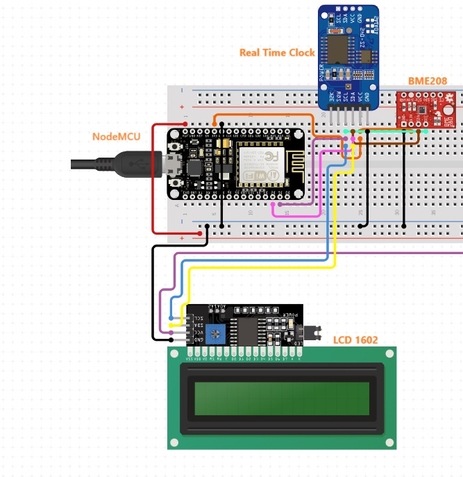
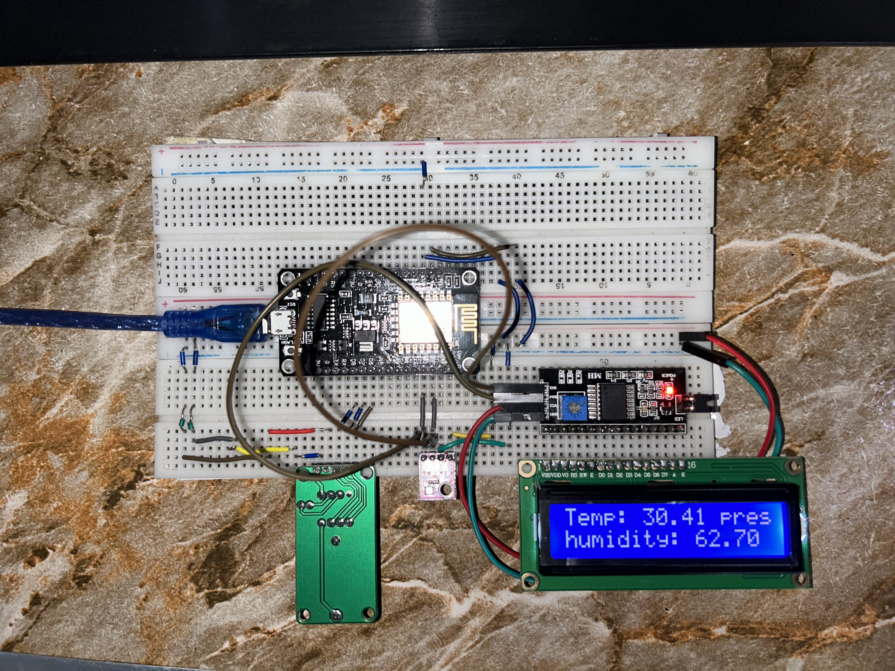

# NodeMCU (Weather Station)
NodeMCU configured as a station point that reads the weather parameters Temperature, Pressure and Humidity from the BME208 sensor and writes the data to the firebase realtime 
database using the [Firebase-ESP-Client](https://github.com/mobizt/Firebase-ESP-Client) library. The NodeMCU is also interfaced with a RTC which used to link the weather data
with the current timestamp.

## Connections and Diagram




## Libraries used
1. **Platform I/O**: VScode IDE extension to develop and build NodeMCU projects
2. **Firebase-ESP-Client**: Library for accessing firebase you can access library from [here](https://github.com/mobizt/Firebase-ESP-Client)
3. **RTC@^2.4.2**: Library for interfacing with RTC DS13002 you can access library from [here](https://github.com/Makuna/Rtc)
4. **BME208**: Library for interfacing with BME208 sensor you can access library from [here](https://github.com/adafruit/Adafruit_BME280_Library)

## Getting Started
1. Download Platform I/O vscode extension from [here](https://platformio.org/install/ide?install=vscode)
2. All previous libraries will be installed automatically
3. Create a firebase realtime database by following this [guide](https://www.youtube.com/watch?v=pP7quzFmWBY)
4. Create a **Cred.h** file in the include directory and insert the following
```
#define WIFI_SSID "YOUR_WIFI_SSID"
#define WIFI_PASSWORD "YOUR_WIFI_PASSWORD"

#define API_KEY "YOUR_API_KEY"
#define DATABASE_URL "YOUR_DATABASE_URI" 

#define NODE_EMAIL "NODEMCU_FIREBASE_AUTH_EMAIL"
#define NODE_PASS "NODEMCU_FIREBASE_AUTH_PASS"
```
5. Build and upload your code to the NodeMCU

